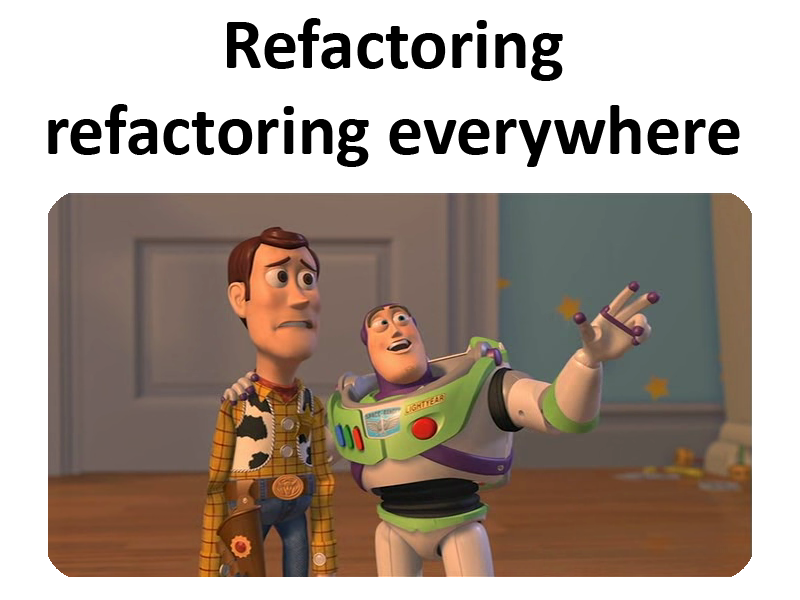

## Hello there, I'm Alexis! 

<p>Full-stack developer progressing every day... </p>

### Where to find me 🔍

[](https://www.linkedin.com/in/asanabrial/)
[](https://github.com/asanabrial)
[](https://github.com/asanabrialopez)


### About me

<p>I am a perfectionist, proactive, and responsible person with 7 years of experience in the sector. I have specialized in .NET but, as an enthusiast of my profession, I am open to work in projects where other technologies.</p>
<p>Outside of work, I have learned and enjoyed using frameworks like Angular and languages like Java. My passion for coding and my ambition to dedicate myself to this for life drive me to find time each day to continue learning.</p>
<br>

### More about me 🤖

```javascript
const alexis = {
    pronouns: "he" | "him",
    code: ["c#", "javascript", "typescript", "python", "php", "java"],
    technologies: {
        frameworks: [".net", ".net framework", "asp .net mvc", "nest.js", "angular", "ionic", "blazor"],
        devOps: ["azure"],
        databases: ["ms-sql", "mariadb", "mongo", "mysql", "sqlite", "oracle"],
        misc: ["node", "express.js", "docker", "selenium", "linux", "git", "jwt", "signalr", "swagger", "ef core", "sequelize", "typeorm", "stored procedures"],
    },
    architecture: ["traditional 'n-layer'", "hexagonal-architecture", "mvc"],
    currentFocus: "learning more about typescript",
    funFact: "quality is not an act, it is a habit",
};
```
